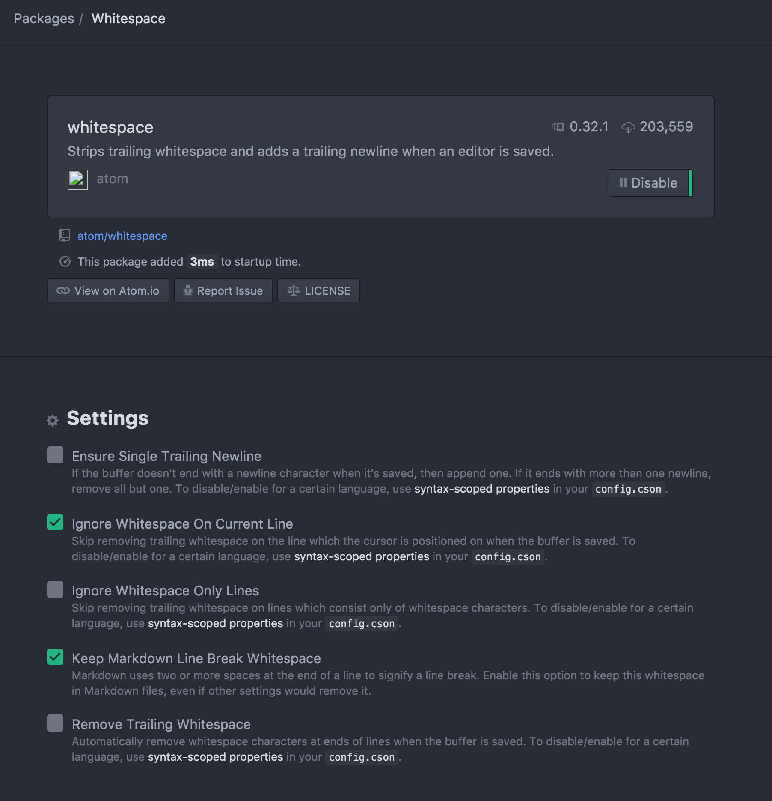

nobel
=====

[![NPM version][npm-image]][npm-url]
[![NPM Downloads][downloads-image]][downloads-url]
<!--[![Build status][travis-image]][travis-url]
[![Test coverage][coveralls-image]][coveralls-url]-->

Nobel (code-generator) creates a REST API for your [Arduino](http://arduino.cc/) board, based on a [RAML](http://raml.org) definition.

##Description

Nobel scaffolds an Arduino application that exposes a REST API.
Then, you can write the logic for interacting with your physical devices inside methods that will be executed when the corresponding URL is invoked.

### Example

Considering the following RAML code:

```yaml
#%RAML 0.8
title: NobelTestingAPI
/servo:
  post:
    description: |
      Moves the servo to the specified angle.
    body:
      application/json:
        example: |
          {"angle": 71}
  put:
    description: |
      Moves the servo buy Adding the specified angle (could be negative)
    body:
      application/json:
        example: |
          {"angle": -10}
  get:
    description: |
      Returns the current servo angle
    responses:
      200:
        body:
          application/json:
            example: |
              { "angle": 71 }

```

Nobel generates a project with several files (following the Arduino specs for splitting a program). One of the files contains the *Handlers*, where
you can write your own code. Associated to the RAML example:

```c
// Handlers

void servoHandler(WebServer &server, WebServer::ConnectionType verb, String uriParams, String queryParams) {
  switch (verb)
    {

    case WebServer::POST:
        server.httpSuccess();
        break;

    case WebServer::PUT:
        server.httpSuccess();
        break;

    case WebServer::GET:
        server.httpSuccess();
        break;

    default:
        server.httpFail();
    }
}

```


##Installation

###Pre-requisites
- NodeJS
- NPM
- Arduino development environment (This is not needed to run Nobel, but will be needed to make something useful with it).


### Install Nobel
Installing Nobel is really simple.
- Open a terminal/command line
- type `npm install -g nobel`

... That's all you need.


##Usage

Nobel is a Command Line Interface (CLI), which means that you will be executing it from a terminal/command line (I don't see a clear value on building a GUI for this).

`nobel -s [your_raml_file] -n [your_project_name]`

The line above shows the minimum parameters set you need to specify in order to scaffold an Arduino Application using Nobel. The result is:
```c
.
└── myArduinoRobot
    ├── A_functions.ino
    ├── B_definitions.ino
    ├── C_handlers.ino
    ├── D_initialization.ino
    └── myArduinoRobot.ino
```

You can find a description of each file in the following sections.

### Arguments

| Argument | Required | Description  |
| ------------- | ------------- | ----- |
| -s --source | YES | The RAML file describing the API to implement on the Arduino program. |
| -n --name   | YES | The name of your project. Nobel will create a folder with this name, and one main project file inside named like this. |
| -t --target | NO | The target directory where the project will be placed. If not specified, the project will be created on the folder where you are running Nobel. |
| -il --installLibraries | NO | If specified, it installs the required Arduino libraries on the folder you specify. [Click here to figure out where this folder is.](http://arduino.cc/en/Guide/Libraries) |
| -h --help | NO | Really? Yes, the user manual will be printed in the terminal/command line |

##Once your app is there
- You just need to open the project with the Arduino IDE (you can use your preferred one, but all this project has been made using the [Official Arduino IDE](http://arduino.cc/en/Main/Software)).
**Important**: If you are installing libraries, you will need to restart the Arduino IDE for those to be recognized (I can't do anything about it. Arduino IDE has some tricky parts. Get over it ;)).
- Compile: If it's not working, something is wrong. Nobel is thought to scaffold a right-away working application (that won't do anything until you put your code on it). If anything goes wrong at anytime, [create an issue](nobel/issues/)
- Put your own code!

###Files
Coding in Arduino is really a lot of fun (despite of/becouse of/but/your choice) it presents some challenges. The main one here: **Memory**.
There could be better ways of implementing the code Nobel creates, but I haven't found it yet (feel free of [making your own suggestions](nobel/issues/). That won't hurt my feelings at all).
Because of this, I needed to hardcode some values (yes, shame on me). You only need to worry about it if you need to **manually** add new resources. If not:
- [your_project_name].ino: Main file. It only includes the libraries required by all of the other files. No need to touch at all.
- A_functions.ino: Contains functions that will be used by the application to parse and route the URLs to the proper handlers (It is not that simple to put these into a library, thanks for asking).
- B_definitions.ino: You will probably need to define some variables that you will use later in a global way. Even though you will probably initialize these
  on `D_initialization.ino`, you will use these in `C_Handlers.ino`, and, since Arduino concatenates in alphabetical order (excepting for the main file),
  not declaring the variables here, will result in errors.
- C_Handlers.ino: You will write your logic here!!! A function will be generated per each result, and a SWITCH CASE inside of it, to determine the HTTP verb being invoked (this could be changing in the future, supporting other code styles. [For Example: One function per Resource-Verb combination](https://github.com/nohorbee/nobel/issues/4))
- D_Initialization.ino: You need a place where everything starts. The `setup` and `loop` functions (which Arduino calls when *booting*) are placed here for you to complete as needed.

Seeing the example is the best way of understanding how to code.
*Note*: The scaffolded application [will use DHCP](https://github.com/nohorbee/nobel/issues/8). You can find the code to change this in the `D_Initialization.ino` file (`setup` function)

###Manually Adding new resources
***Sorry!*** I'll try to improve this, but this far, for an MVP, it is what it is!

**Don't bother reading this if you are NOT manually adding new resources.**

####A_Functions.ino
- Since `sizeof` function is not properly working, I needed to hardcode the resources array length on the very first lin:
  `const byte SIZE_RESOURCES = 5; // constant until resolve what's going on with sizeof`. Change it if you manually add or remove resources.
- Since I'm using a FLASH_ARRAY (basically for placing *big* amounts of data in the program memory instead of the variables space), I can't freely use an array and pass pointers as parameters or return these. So, the array needs to be defined inside the function that will use it. *ugh indeed*.
```c
 FLASH_STRING_ARRAY(resources,
      PSTR("/resourceA/"),
      PSTR("/resourceB/"),
      PSTR("/resourceC/"),
      PSTR("/resourceD/"),
      PSTR("/resourceE/")
      // add more if needed
  );
```
When adding one, you will also need to add the proper *Handler* in D_Initialization.ino

####D_Initialization.ino

- Add a new handler:
```c
void registerHandlers() {
handlers[0].method = &resourceAHandler;
handlers[1].method = &resourceBlHandler;
handlers[2].method = &resourceCHandler;
handlers[3].method = &resourceDHandler;
handlers[4].method = &resourceEHandler;
}
```
**Important**: The order is the way of matching a resource with it handler!!! It's much more efficient and doable than trying to do some kind of "reflection". So, make sure of adding the handlers in the same order than the resources on the previous step.
Now, a handler, is basically a pointer to a function (Nobel places these functions on `C_Handlers.ino`). So, if you have `&resourceAHandler`, you will need:

####C_Handlers.ino
```c
void resourceAHandler(WebServer &server, WebServer::ConnectionType verb, String uriParams, String queryParams) {
  // Your code here (generally, start with a switch)
}

```


##Example

This example will expose an API for turning on and off a LED connected to the pin 9.

###Create the RAML file.
```yaml
#%RAML 0.8
title: NobelExampleAPI
/led:
  post:
    description: Turns the light on
  delete:
    description: Turns the light off
```
and save it (the example asumes that it will be called `ramlExample.raml`)

###Scaffold the application
```
nobel -s nobelExample.raml -n ledController
```
or
```
nobel -s nobelExample.raml -n ledController -il [path_to_your_arduino_libraries_directory]
```
if you haven't ever installed the required libraries.

###Put your own code
- Open the IDE.

#### B_Definitions.ino
Add this line:
```c
byte ledPin = 9; // It's a good practice to use a variable to semantically represent your Arduino output.
```

#### D_Initialization.ino
Add this line in the `void setup()` function
```c
pinMode(ledPin, OUTPUT); // We are specifying that the pin 9 will be used as an output.
```

The function code should look like this:
```c
void setup() {
  Serial.begin(9600);
  pinMode(ledPin, OUTPUT);
  ethStart();
  registerHandlers();
  webserver.setFailureCommand(&dispatch);
  webserver.begin();
}
```

####C_Handlers
```c
digitalWrite(ledPin, HIGH); // Turns the led on
digitalWrite(ledPin, LOW); // Turns the led off
```

Let's add both calls to the `POST` and `DELETE` methods, and the final code should look like this:

```c
void ledHandler(WebServer &server, WebServer::ConnectionType verb, String uriParams, String queryParams) {
  switch (verb)
    {

    case WebServer::POST:
        digitalWrite(ledPin, HIGH);
        server.httpSuccess();
        break;

    case WebServer::DELETE:
        digitalWrite(ledPin, LOW);
        server.httpSuccess();
        break;

    default:
        server.httpFail();
    }
}
```

###Compile and deploy

By default, the generated code will make Arduino take an IP by using DHCP. Open a [*Serial Monitor*](http://arduino.cc/en/guide/Environment#serialmonitor) to see the assigned IP.
In order to test the app, use any program capable of sending HTTP messages via network. [Postman extension for chrome](https://chrome.google.com/webstore/detail/postman-rest-client/fdmmgilgnpjigdojojpjoooidkmcomcm?hl=en) is my favorite.
- POST http://[the_ip_DHCP_assigned]/led   (should turn the led ON).
- DELETE http://[the_ip_DHCP_assigned]/led   (should turn the led OFF).

##Contributing to this code
- If you are using Atom, please make sure that the following configuration is correct. If not, it will add or remove "\n" and spaces characters from your templates making the unit tests to fail



##Credits

- Without any doubt, I would have quit the idea of creating this project if I didn't find a good HTTP server for Arduino.
So, it wouldn't be possible at all without [Webduino](https://github.com/sirleech/Webduino) by [sirleech](https://github.com/sirleech). Thanks to him and his amazing job.
- 2 KB for all my variables? Where to put the *resources* array? In the Program Memory!!! That is possible thanks to the [Flash](https://github.com/mikalhart/Flash) module by [mikalhart](https://github.com/mikalhart).


[npm-image]: https://img.shields.io/npm/v/nobel.svg?style=flat
[npm-url]: https://npmjs.org/package/nobel
[downloads-image]: https://img.shields.io/npm/dm/nobel.svg?style=flat
[downloads-url]: https://npmjs.org/package/nobel
[travis-image]: https://img.shields.io/travis/nohorbee/nobel.svg?style=flat
[travis-url]: https://travis-ci.org/nohorbee/nobel
[coveralls-image]: https://img.shields.io/coveralls/nohorbee/nobel.svg?style=flat
[coveralls-url]: https://coveralls.io/r/nohorbee/nobel?branch=master
